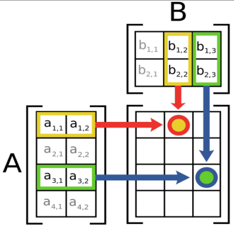

# project-9b

## Part 1: Dot product

Write a function named `dot_prod` that takes **two lists of numbers** (vectors) as arguments and returns their **dot product**. In the context of matrix operations, a vector is just a list of numbers in a specific order.

### What is the dot product?

The **dot product** of two vectors is the sum of the products of their corresponding elements.

If  
- $\mathbf{a} = [a_1, a_2, \dots, a_n]$  
- $\mathbf{b} = [b_1, b_2, \dots, b_n]$

Then the dot product of $a$ and $b$ is: $a \cdot b = a_1 b_1 + a_2 b_2 + \dots + a_n b_n$

If
- $a$ = [-7, 2, 1]
- $b$ = [-2, -3, 9]

Then $a \cdot b$ = (-7)*(-2) + 2*(-3) + 1*9 = 14 - 6 + 9 = 17


## Part 2: Matrix multiplication

Write a function named `matrix_mult` that takes two 2D matrices (each represented as a list of lists of numbers) and returns their matrix product (another list of lists). If the number of columns in the first matrix doesn't match the number of rows in the second matrix, then the two matrices cannot be multiplied (at least not in that order) and the function should return None.

### Matrix multiplication rules:

If
- Matrix $A$ is $p \times q$ (p rows and q columns)
- Matrix $B$ is $q \times r$ (q rows and r columns)

Then their product $C = AB$ will be a matrix of size $p \times r$.

Say we're multiplying matrices A and B to get matrix C (C = AB). The mathematical convention is that $C_{ij}$ is the entry at row $i$ and column $j$ of matrix C. Each number $C_{ij}$ in matrix C is the **dot product** of the $i^{th}$ row of A and the $j^{th}$ column of B.

**Your matrix_mult() function can just call your dot_prod() function for each cell of the result matrix.**

The figure below shows that to get the number for row 1 column 2, we take the dot product of row 1 of matrix A with column 2 of matrix B. Similarly, to get the number for row 3 column 3, we take the dot product of row 3 of matrix A with column 3 of matrix B. You follow that same pattern to get the number for each cell of the result matrix.



_(Image uploaded to Wikipedia by Lakeworks under a [Creative Commons license](https://creativecommons.org/licenses/by-sa/3.0/).)_

If
- A = [[3, 1], [-8, 5], [1, 4]]
- B = [[1, 4, 7, 1], [-5, -8, 4, 3]]

Then because A is a $3 \times 2$ matrix and B is a $2 \times 4$ matrix, we know that their product AB must be a $3 \times 4$ matrix.

After calling our dot product function 12 times (once for each number in AB), we find that AB is equal to [[-2, 4, 25, 6], [-33, -72, -36, 7], [-19, -28, 23, 13]].

Hints:
1. The matrix rows are already lists, but you'll need to make lists of the column values to pass to your dot_prod() function.
2. Remember that in Python, instead of counting from 1 to n, list indices count from 0 to n-1. You don't need to do any math to adjust for this, you just need to make sure you loop through the correct values.

Your function could be used like this:
```
matrix_A = [[7.04, 2, -4, 2], [6, -1, 3.5, 4], [8, -8, -4, 9]]
matrix_B = [[8, 2], [-3.789, 7], [9, 4], [6, 6.7]]
result = matrix_mult(matrix_A, matrix_B)
```

The file must be named: matrix_mult.py
